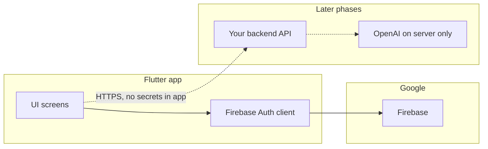

# GetaWay v2 — architecture (beginner-friendly)

This document explains **how the app is organized** and **how we will keep it secure** as it grows.

## Big picture

Today, the app talks to **Firebase** for initialization and (soon) authentication. **OpenAI and any private API keys must live on a backend** you control, never inside the Flutter app.

## Folder layout (feature-based)

We group code by **feature** so one area of the product does not sprawl across random folders.

| Folder | Purpose |
|--------|---------|
| `lib/app/` | App-wide wiring: `MaterialApp`, route table, title. |
| `lib/core/` | Cross-cutting basics used by many features (for example **theme**). |
| `lib/features/<name>/` | Everything for one feature, split further when it grows. |
| `lib/shared/` | Small widgets or helpers reused by multiple features (empty until needed). |

Inside a feature you will often see:

- `presentation/screens/` — full pages.
- `presentation/widgets/` — UI pieces used only on those screens.
- `data/services/` — calls to Firebase, HTTP, or local storage.

Right now **splash**, **auth**, and **home** each live under `lib/features/`.

## Navigation flow (current)

1. **`main.dart`** initializes Flutter bindings and Firebase, then runs `GetawayApp`.
2. **`GetawayApp`** sets `home` to **`SplashScreen`**.
3. **Splash** waits briefly, then checks `FirebaseAuth.instance.currentUser`:
   - If a user exists → **Home** (placeholder).
   - If not → **Login**.
4. **Login** (Phase 1): after validation, navigates to **`/home`** as a **temporary shell** until Phase 3 connects real sign-in.
5. **Home** logout calls `AuthService().logout()` then **`/login`**.

Named routes registered today: `/login`, `/home`.

## Security principles (mandatory for this project)

1. **No secrets in source or in the client app**  
   Use `.env` locally for non-committed values, and a **server** for anything sensitive. `.env` is listed in `.gitignore`; `.env.example` shows safe placeholders only.

2. **OpenAI**  
   Only your **backend** should hold the API key and call OpenAI. The Flutter app sends **user context** (location summary, budget, trip history ids, etc.) to your API; the API validates and rate-limits.

3. **Firebase Auth**  
   Use official SDKs, validate input on the client for UX, and enforce rules on the server / Firestore rules (Phase 2–3).

4. **Errors**  
   Show friendly messages to users; log details only where appropriate (e.g. crash reporting), not full stack traces with PII.

5. **Location**  
   Request permission clearly, use location only for features the user expects, and avoid logging raw coordinates in analytics.

6. **Configuration files**  
   `google-services.json` identifies your Firebase project. Teams often commit it for Android builds; understand it is **not** a private server key, but still treat the repo as semi-sensitive. Never commit **service account** JSON or OpenAI keys.

## Firestore (later)

When you add Firestore for saved trips, follow a **rules-first** mindset. A starter sketch lives in [`firestore_rules_sketch.md`](firestore_rules_sketch.md); implement collections to match that model, then paste tested rules into the Firebase console.

## What changes in the next phase

**Phase 2** (remaining slices) can add more platforms or enable Firestore when you are ready. **Phase 3** replaces the login button’s placeholder navigation with real **email / Google / phone** flows and proper error handling.

When you are ready, say so and we will tackle **Phase 2** or **Phase 3** one small step at a time.
